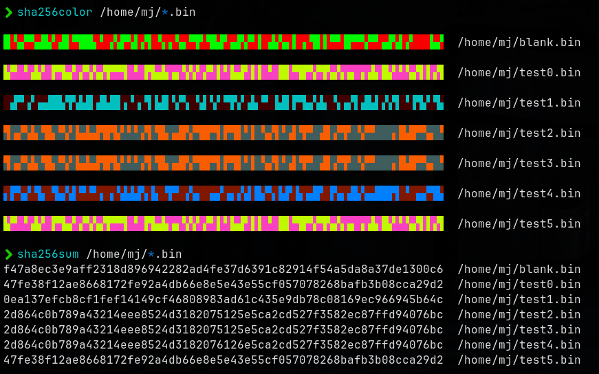

# colorhash

Features:

* Easy-to-read colorbar representation of file hashcodes
* Fast detection of duplicated files or minor differences in hashcodes
* [Your Tool's Name] is designed for [briefly mention the purpose of your tool, e.g., "file comparison", "version control", etc.]

Get started by exploring the repo and contributing to this project! If you have any feedback or suggestions, feel free to open a pull
request."

You can customize it as per your requirements and add more details about your tool's features, functionality, and any other relevant
information.
